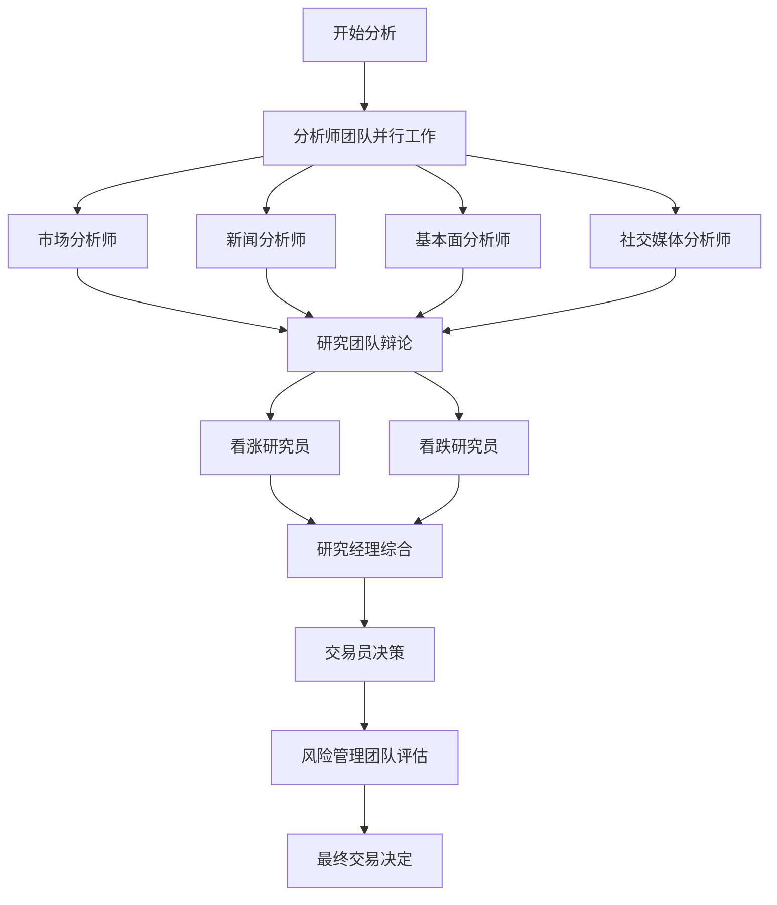

**User**

@TradingAgents/ 帮我总结理解一下这个代码结构

---

**Cursor**

我来帮你分析和总结这个TradingAgents项目的代码结构。让我先深入了解一下整个项目的架构。

# TradingAgents 代码结构总结

## 🏗️ 整体架构

**TradingAgents** 是一个基于多智能体的金融交易框架，模拟真实交易公司的运作模式。它使用 **LangGraph** 构建，通过多个专业化的LLM驱动的智能体协同工作来进行市场分析和交易决策。

## 📁 项目结构

```
TradingAgents/
├── 📂 tradingagents/           # 核心框架代码
│   ├── 📂 agents/              # 各种智能体实现
│   ├── 📂 dataflows/           # 数据获取和处理
│   ├── 📂 graph/               # 工作流图和协调逻辑
│   └── 📄 default_config.py    # 默认配置
├── 📂 cli/                     # 命令行界面
├── 📂 assets/                  # 资源文件（图片等）
├── 📄 main.py                  # 主程序入口
├── 📄 requirements.txt         # 依赖包
└── 📄 README.md               # 项目文档
```

## 🤖 核心智能体架构

### 1. **分析师团队 (Analyst Team)**
- **📊 Market Analyst** (`market_analyst.py`): 市场分析师
- **📰 News Analyst** (`news_analyst.py`): 新闻分析师  
- **💰 Fundamentals Analyst** (`fundamentals_analyst.py`): 基本面分析师
- **📱 Social Media Analyst** (`social_media_analyst.py`): 社交媒体情感分析师

### 2. **研究团队 (Researcher Team)**
- **🐂 Bull Researcher** (`bull_researcher.py`): 看涨研究员
- **🐻 Bear Researcher** (`bear_researcher.py`): 看跌研究员
- **👨‍💼 Research Manager** (`research_manager.py`): 研究经理

### 3. **交易执行**
- **💼 Trader** (`trader.py`): 交易员

### 4. **风险管理团队**
- **⚠️ Risk Manager** (`risk_manager.py`): 风险管理经理
- **🔴 Aggressive Debator** (`aggresive_debator.py`): 激进分析师
- **🟡 Neutral Debator** (`neutral_debator.py`): 中性分析师  
- **🟢 Conservative Debator** (`conservative_debator.py`): 保守分析师

## 🔄 工作流程



## 📊 数据流架构

### **数据源配置** (`dataflows/`)
- **🔄 Interface** (`interface.py`): 统一数据接口，支持多数据源切换
- **📈 Alpha Vantage** (`alpha_vantage_*.py`): 股票数据、新闻、基本面
- **🌐 Yahoo Finance** (`y_finance.py`): 股价和技术指标
- **🤖 OpenAI** (`openai.py`): AI驱动的数据分析
- **🔍 Google News** (`google.py`): 新闻数据
- **💾 Local** (`local.py`): 本地数据缓存

### **数据工具** (`agents/utils/`)
- **📊 Core Stock Tools** (`core_stock_tools.py`): 核心股票数据工具
- **📈 Technical Indicators** (`technical_indicators_tools.py`): 技术指标工具
- **💰 Fundamental Data Tools** (`fundamental_data_tools.py`): 基本面数据工具
- **📰 News Data Tools** (`news_data_tools.py`): 新闻数据工具

## ⚙️ 核心组件

### **1. 图设置 (`graph/setup.py`)**
- 使用 **LangGraph** 构建智能体工作流
- 定义智能体之间的连接和数据流
- 管理状态传递和条件逻辑

### **2. 信号处理 (`graph/signal_processing.py`)**
- 处理和整合来自不同智能体的信号
- 信号权重和优先级管理

### **3. 传播机制 (`graph/propagation.py`)**
- 管理信息在智能体网络中的传播
- 协调并行和串行处理

### **4. 记忆系统 (`agents/utils/memory.py`)**
- **ChromaDB** 向量数据库存储历史决策
- **OpenAI Embeddings** 进行语义搜索
- 支持经验学习和反思机制

## 🔧 配置系统

### **默认配置** (`default_config.py`)
```python
{
    "llm_provider": "openai",
    "deep_think_llm": "o4-mini",      # 深度思考模型
    "quick_think_llm": "gpt-4o-mini", # 快速思考模型
    "data_vendors": {
        "core_stock_apis": "yfinance",
        "fundamental_data": "alpha_vantage", 
        "news_data": "alpha_vantage"
    }
}
```

## 🖥️ 用户界面

### **CLI 界面** (`cli/`)
- **Rich** 库提供美观的终端界面
- 实时显示智能体工作状态
- 交互式配置选择
- 进度跟踪和结果展示

## 🚀 使用方式

### **1. 程序化使用**
```python
from tradingagents.graph.trading_graph import TradingAgentsGraph
from tradingagents.default_config import DEFAULT_CONFIG

ta = TradingAgentsGraph(debug=True, config=DEFAULT_CONFIG.copy())
_, decision = ta.propagate("NVDA", "2024-05-10")
```

### **2. CLI 使用**
```bash
python -m cli.main
```

## 🔑 关键特性

1. **🔄 模块化设计**: 每个智能体都是独立模块，易于扩展
2. **📊 多数据源支持**: 灵活的数据源配置和自动切换
3. **🧠 记忆和学习**: 基于向量数据库的经验存储
4. **⚡ 并行处理**: 智能体可以并行工作提高效率
5. **🛡️ 风险管理**: 多层风险评估和控制
6. **🔧 高度可配置**: 支持不同LLM提供商和参数调整

## 💡 核心创新

- **多智能体协作**: 模拟真实交易团队的分工协作
- **辩论机制**: 看涨/看跌研究员的对抗性分析
- **分层决策**: 从分析 → 研究 → 交易 → 风控的完整流程
- **自适应学习**: 通过记忆系统不断改进决策质量

这个框架展现了现代AI在金融领域应用的前沿实践，将复杂的交易决策过程分解为专业化的智能体协作，既保证了决策的全面性，又提供了良好的可解释性和可控性。

```plaintext
TradingAgents/
├── 📂 tradingagents/           # 核心框架代码
│   ├── 📂 agents/              # 各种智能体实现
│   ├── 📂 dataflows/           # 数据获取和处理
│   ├── 📂 graph/               # 工作流图和协调逻辑
│   └── 📄 default_config.py    # 默认配置
├── 📂 cli/                     # 命令行界面
├── 📂 assets/                  # 资源文件（图片等）
├── 📄 main.py                  # 主程序入口
├── 📄 requirements.txt         # 依赖包
└── 📄 README.md               # 项目文档
```

```plaintext
graph TD
    A[开始分析] --> B[分析师团队并行工作]
    B --> C[市场分析师]
    B --> D[新闻分析师] 
    B --> E[基本面分析师]
    B --> F[社交媒体分析师]
    
    C --> G[研究团队辩论]
    D --> G
    E --> G
    F --> G
    
    G --> H[看涨研究员]
    G --> I[看跌研究员]
    H --> J[研究经理综合]
    I --> J
    
    J --> K[交易员决策]
    K --> L[风险管理团队评估]
    L --> M[最终交易决定]
```

```python
{
    "llm_provider": "openai",
    "deep_think_llm": "o4-mini",      # 深度思考模型
    "quick_think_llm": "gpt-4o-mini", # 快速思考模型
    "data_vendors": {
        "core_stock_apis": "yfinance",
        "fundamental_data": "alpha_vantage", 
        "news_data": "alpha_vantage"
    }
}
```

```python
from tradingagents.graph.trading_graph import TradingAgentsGraph
from tradingagents.default_config import DEFAULT_CONFIG

ta = TradingAgentsGraph(debug=True, config=DEFAULT_CONFIG.copy())
_, decision = ta.propagate("NVDA", "2024-05-10")
```

```shellscript
python -m cli.main
```

